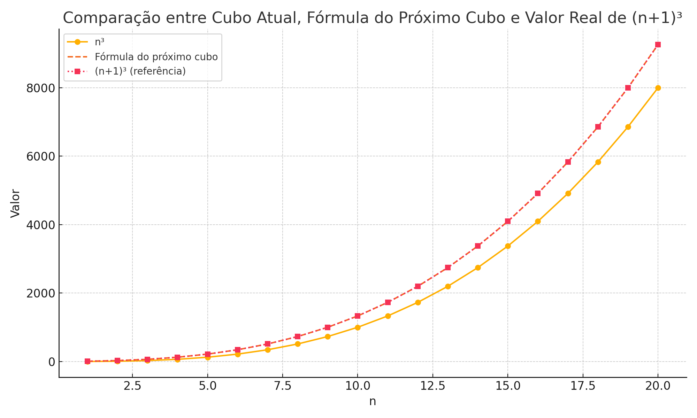

# Cubic Jump Formula / Fórmula de Salto Entre Cubos

Este projeto apresenta uma fórmula matemática que permite calcular o próximo cubo perfeito a partir de um cubo perfeito conhecido e sua raiz cúbica, sem recalcular do zero.

This project introduces a mathematical formula to calculate the next perfect cube based on a known cube and its root, using only arithmetic operations.

## 📐 A Fórmula / The Formula

Dado um valor `n`:

- Cubo atual / Current cube: `n³`
- Próximo cubo perfeito / Next perfect cube:  
  (n + 1)^3 = n^3 + (3 * n) * (n + 1) + 1

## 💻 Código / Code

```python
def raiz_cubica():
    n = int(input("Digite a raiz cúbica (n): "))
    y = n**3
    z = y + (n * 3) * (n + 1) + 1
    py = (n * 2) ** 3

    print(f"{n}³ = {y}")
    print(f"Próximo cubo perfeito: {z}")
    print(f"Cálculo: {y} + (3*{n})*({n}+1) + 1 = {z}")
    print(f"{y} * 8 = {py}, que é (2*{n})³")
```
✨ **Por que essa fórmula é inovadora?**

Essa fórmula representa uma nova forma de pensar os cubos perfeitos. Em vez de recalcular  
\((n+1)^3\) do zero, eu desenvolvi uma expressão que aproveita o valor anterior \(n^3\),  
fazendo um salto matemático incremental:

\[
(n+1)^3 = n^3 + 3n(n+1) + 1
\]

Esse formato traz diversas vantagens:

- **Reutilização matemática:** Ao aproveitar o cubo já conhecido, a fórmula evita repetição de cálculos e permite um encadeamento direto entre termos.

- **Simplicidade aritmética:** Utiliza apenas multiplicações e somas — ideal para linguagens ou sistemas que não têm suporte direto para exponenciação.

- **Aplicabilidade computacional:** Pode ser empregada para gerar cubos perfeitos em dispositivos com recursos limitados ou em algoritmos otimizados para alto desempenho.

- **Valor didático:** A fórmula revela que os cubos não são valores isolados, mas parte de uma progressão conectada e estruturada. Pode ser útil no ensino de binômios, padrões cúbicos e fatorações.

## 📊 Visualização / Visualization



## 📂 Licença / License

MIT
